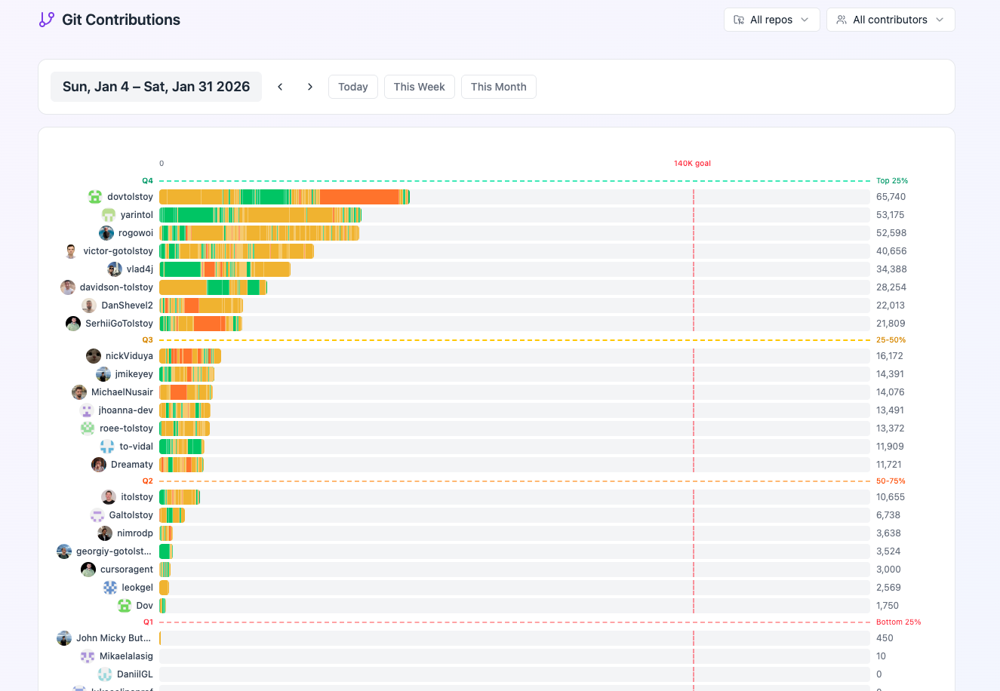
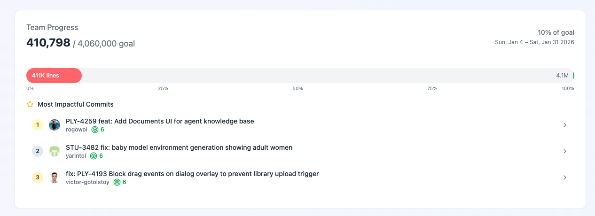

# Git Contributions

> **Productivity = Lines × Quality**

Track developer productivity with AI-powered quality scoring. Analyze PRs when they merge, score code quality using AI, and visualize team contributions on a beautiful dashboard.

[](https://vercel.com/new/clone?repository-url=https%3A%2F%2Fgithub.com%2Fyour-org%2Fgit-contributions&env=VITE_SUPABASE_URL,VITE_SUPABASE_ANON_KEY&envDescription=Supabase%20credentials%20for%20the%20dashboard&project-name=git-contributions-dashboard&repository-name=git-contributions)

## Features

- **AI-Powered Quality Scoring** - Every merged PR gets analyzed by GPT-4o acting as "Jeff Dean" reviewing your code
- **GitHub Action** - Automatically runs on PR merge, no manual intervention needed
- **Real-time Dashboard** - Beautiful charts showing contributions, quality trends, and leaderboards
- **CLI for Backfill** - Sync historical PRs to populate your dashboard instantly
- **Team Insights** - Daily summaries, contributor rankings, and quality metrics

## Screenshots

### Contributor Leaderboard
Track contributions by team member with quality-weighted bars. Colors indicate code quality scores (green = high quality, orange = average).



### Team Progress
Monitor team goals, see total lines shipped, and highlight the most impactful commits of the period.



## Quick Start (5 Minutes)

### 1. Set Up Supabase

1. Create a free [Supabase](https://supabase.com) project
2. Go to SQL Editor and run the migration:

```sql
-- Copy contents from supabase/migrations/001_initial.sql
```

3. Get your project URL and keys from Settings > API

### 2. Add GitHub Action

Create `.github/workflows/contributions.yml` in your repository:

```yaml
name: Track Contributions

on:
  pull_request:
    types: [closed]

jobs:
  analyze:
    if: github.event.pull_request.merged == true
    runs-on: ubuntu-latest
    steps:
      - uses: your-org/git-contributions@v1
        with:
          supabase-url: ${{ secrets.SUPABASE_URL }}
          supabase-key: ${{ secrets.SUPABASE_KEY }}
          openai-api-key: ${{ secrets.OPENAI_API_KEY }}
          github-token: ${{ secrets.GITHUB_TOKEN }}
          min-lines: '10'
```

### 3. Add Repository Secrets

In your GitHub repository, go to Settings > Secrets and add:

- `SUPABASE_URL` - Your Supabase project URL
- `SUPABASE_KEY` - Your Supabase service role key
- `OPENAI_API_KEY` - Your OpenAI API key

### 4. Deploy Dashboard

Click the "Deploy with Vercel" button above, or deploy manually:

```bash
cd packages/dashboard
npm run build
# Deploy dist/ to any static hosting
```

Set environment variables:
- `VITE_SUPABASE_URL` - Your Supabase project URL
- `VITE_SUPABASE_ANON_KEY` - Your Supabase anon/public key

## CLI Usage

### Install

```bash
npm install -g @git-contributions/cli
```

### Commands

```bash
# Initialize database (shows SQL to run)
git-contributions init-db

# Backfill historical PRs
git-contributions sync owner/repo --days 30

# Analyze a specific PR
git-contributions analyze owner/repo#123
```

### Environment Variables

Create a `.env` file:

```env
SUPABASE_URL=https://your-project.supabase.co
SUPABASE_KEY=your-service-role-key
GITHUB_TOKEN=ghp_your-token
OPENAI_API_KEY=sk-your-key
```

## How Quality Scoring Works

Each PR is analyzed using a prompt that simulates Jeff Dean (Google Senior Fellow) reviewing your code:

| Score | Rating | Description |
|-------|--------|-------------|
| 1-3 | Poor | Missing basics, needs rework |
| 4-5 | Average | Most code lands here |
| 6 | Good | Solid work |
| 7 | Very Good | Top 10% |
| 8+ | Exceptional | Rare excellence |

The analysis:
- Quotes actual code snippets from the diff
- References specific file paths and function names
- Explains WHY with technical reasoning
- Considers project context (AGENTS.md, .cursor/rules)

## Project Structure

```
git-contributions/
├── packages/
│   ├── core/           # Shared analysis logic
│   │   ├── analyzer.ts # AI analysis with GPT-4o
│   │   ├── github.ts   # GitHub API integration
│   │   └── supabase.ts # Database operations
│   │
│   ├── action/         # GitHub Action
│   │   ├── action.yml  # Action metadata
│   │   └── src/        # Action entry point
│   │
│   ├── dashboard/      # React dashboard
│   │   └── src/
│   │       ├── components/
│   │       └── hooks/
│   │
│   └── cli/            # CLI for backfill
│       └── src/
│           └── commands/
│
└── supabase/
    └── migrations/     # Database schema
```

## Development

```bash
# Install dependencies
pnpm install

# Build all packages
pnpm build

# Run dashboard locally
pnpm dev
```

## Configuration

### Action Inputs

| Input | Required | Default | Description |
|-------|----------|---------|-------------|
| `supabase-url` | Yes | - | Supabase project URL |
| `supabase-key` | Yes | - | Supabase service role key |
| `openai-api-key` | Yes | - | OpenAI API key |
| `github-token` | Yes | - | GitHub token for API access |
| `min-lines` | No | `10` | Minimum lines to trigger analysis |

### Dashboard Environment

| Variable | Description |
|----------|-------------|
| `VITE_SUPABASE_URL` | Supabase project URL |
| `VITE_SUPABASE_ANON_KEY` | Supabase anon/public key |

## Contributing

1. Fork the repository
2. Create a feature branch
3. Make your changes
4. Submit a pull request

## License

MIT
